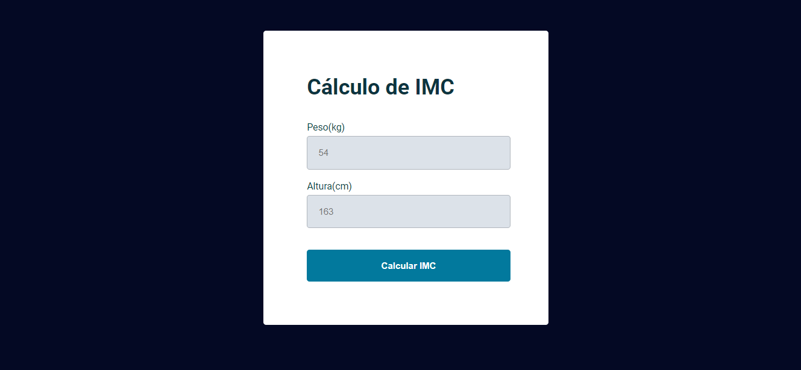

# Calculadora de IMC

## Sobre o projeto
Uma calculadora de IMC, na qual ao clicar no botão "calcular IMC", valida se os valores digitados são do tipo numérico e, caso sejam, é aberto um modal com o resultado, senão é exibido um alerta de erro.
## Tecnologias utilizadas
- HTML
- CSS
- JavaScript
